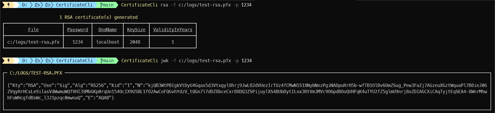

[](https://github.com/aimenux/CertificateCli/actions/workflows/ci.yml)

# CertificateCli
```
A global tool to generate rsa/ecc certificates and json web keys
```

> In this repo, i m building a global tool that allows to generate rsa/ecc certificates and json web keys.
>
> The tool is based on two sub commmands :
> - Use sub command `Rsa` to generate an rsa certificate
> - Use sub command `Ecc` to generate an ecc certificate
> - Use sub command `Jwk` to generate a jwk from an rsa certificate
>
>
> To run code in debug or release mode, type the following commands in your favorite terminal : 
> - `.\App.exe Rsa -f [certificate-file] -p [certificate-password]`
> - `.\App.exe Ecc -f [certificate-file] -p [certificate-password]`
> - `.\App.exe Jwk -f [certificate-file] -p [certificate-password]`
>
>
> To install, run, update, uninstall global tool from a local source path, type commands :
> - `dotnet tool install -g --configfile .\Nugets\local.config CertificateCli`
> - `CertificateCli -h`
> - `CertificateCli Rsa -f [certificate-file] -p [certificate-password]`
> - `CertificateCli Ecc -f [certificate-file] -p [certificate-password]`
> - `CertificateCli Jwk -f [certificate-file] -p [certificate-password]`
> - `dotnet tool update -g CertificateCli --ignore-failed-sources`
> - `dotnet tool uninstall -g CertificateCli`
>
> To install global tool from [nuget source](https://www.nuget.org/packages/CertificateCli), type these command :
> - For stable version : `dotnet tool install -g CertificateCli --ignore-failed-sources`
> - For prerelease version : `dotnet tool install -g CertificateCli --version "*-*" --ignore-failed-sources`
>
>
> 
>

**`Tools`** : vs22, net 6.0, certificate-manager, text-copy, command-line, spectre-console